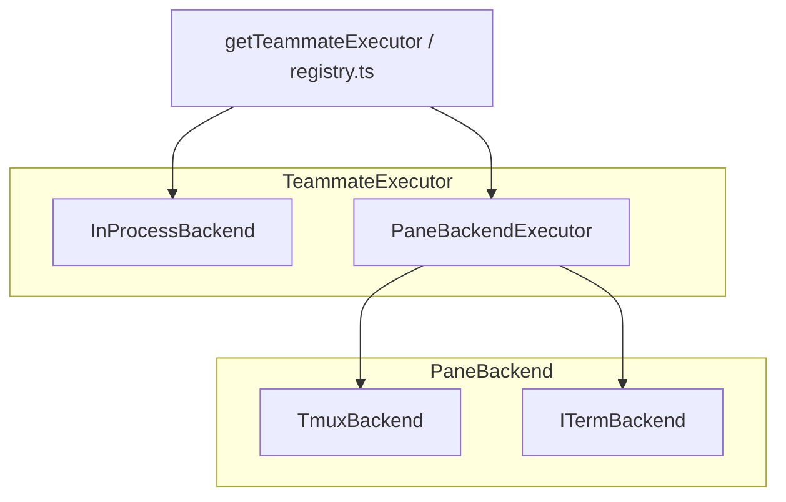
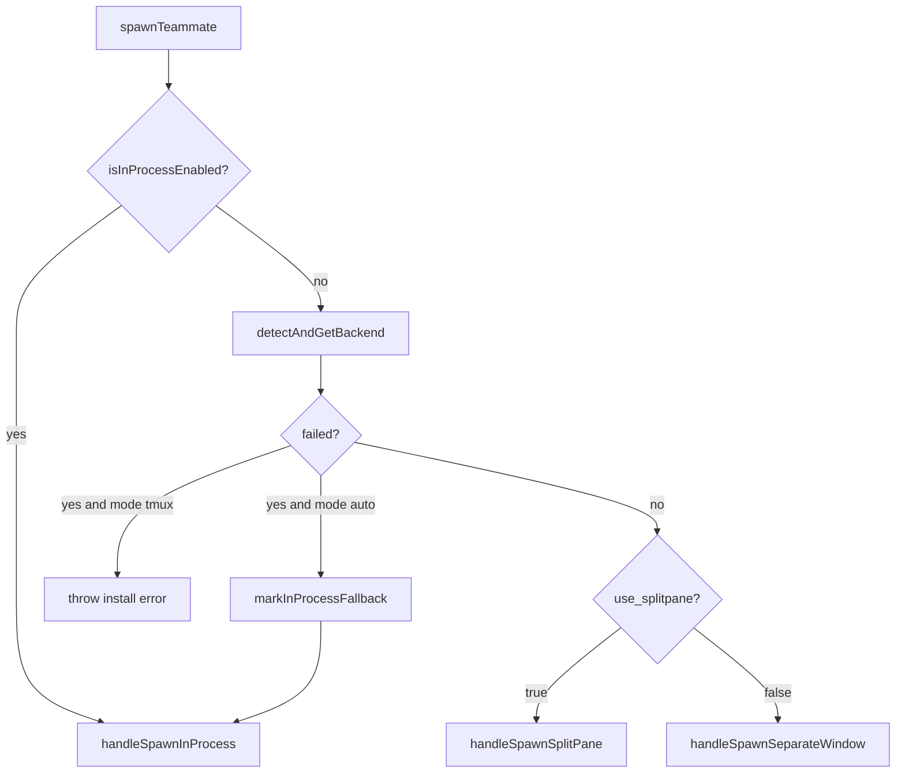

# Agent Swarm（多队友）架构设计

本文说明 Claude Code 中 **Agent Swarm / Teammate（队友）** 相关实现的设计要点。实现主体在 [`src/utils/swarm/`](../src/utils/swarm/)，但与 **队友创建、邮箱、同进程执行** 强耦合的代码分布在其他目录，下文一并说明。

## 1. 问题与目标

- **Leader（团队主导）**：用户主要交互的主会话，可创建团队、spawn 多个 Teammate。
- **Teammate（队友）**：独立执行任务的 Agent，需与 Leader 共享**团队元数据**、**异步消息**，并在需要时把**工具权限请求**交给 Leader 侧 UI 处理。
- **执行形态**：
  - **Pane backend**：在 tmux / iTerm2 中开新窗格，子进程再启动一份 Claude Code（CLI 身份参数区分队友）。
  - **In-process**：在同一 Node 进程内用 `AsyncLocalStorage` 隔离队友上下文，走 `runAgent` 主循环，任务挂在 `AppState.tasks`。

设计核心是把「终端窗格操作」与「队友生命周期」分层，并用**文件系统邮箱**统一跨进程消息；权限在子进程队友上走邮箱转发，在同进程队友上优先走 **REPL 桥接**。

## 2. 模块地图

### 2.1 类型与契约

| 文件 | 职责 |
|------|------|
| [`src/utils/swarm/backends/types.ts`](../src/utils/swarm/backends/types.ts) | `BackendType`（`tmux` \| `iterm2` \| `in-process`）、`PaneBackend`（窗格 CRUD、发命令）、`TeammateExecutor`（spawn / sendMessage / terminate / kill / isActive）、`TeammateSpawnConfig` / `TeammateSpawnResult`、`TeammateMessage` 等 |

### 2.2 后端注册与环境检测

| 文件 | 职责 |
|------|------|
| [`src/utils/swarm/backends/registry.ts`](../src/utils/swarm/backends/registry.ts) | 动态注册 `TmuxBackend` / `ITermBackend`、`detectAndGetBackend()` 缓存、`isInProcessEnabled()`、`getTeammateExecutor()`、`markInProcessFallback()` |
| [`src/utils/swarm/backends/detection.ts`](../src/utils/swarm/backends/detection.ts) | 是否在 tmux、是否 iTerm2、tmux/it2 是否可用等探测 |
| [`src/utils/swarm/backends/teammateModeSnapshot.ts`](../src/utils/swarm/backends/teammateModeSnapshot.ts) | 会话启动时固化 `teammateMode`（`auto` \| `tmux` \| `in-process`），避免运行中改配置导致行为漂移；支持 CLI `--teammate-mode` |

### 2.3 终端分屏实现与布局

| 文件 | 职责 |
|------|------|
| [`src/utils/swarm/backends/TmuxBackend.ts`](../src/utils/swarm/backends/TmuxBackend.ts) | tmux 窗格：当前会话分屏或外部 `claude-swarm` session + 独立 socket |
| [`src/utils/swarm/backends/ITermBackend.ts`](../src/utils/swarm/backends/ITermBackend.ts) | iTerm2 + `it2` CLI 原生分屏 |
| [`src/utils/swarm/teammateLayoutManager.ts`](../src/utils/swarm/teammateLayoutManager.ts) | 队友颜色轮询分配；封装对 `detectAndGetBackend` 的委托（`createTeammatePaneInSwarmView`、`sendCommandToPane` 等） |

### 2.4 适配层：从窗格到统一 Executor

| 文件 | 职责 |
|------|------|
| [`src/utils/swarm/backends/PaneBackendExecutor.ts`](../src/utils/swarm/backends/PaneBackendExecutor.ts) | 将 `PaneBackend` 适配为 `TeammateExecutor`：建 pane、拼 CLI、写入邮箱首条指令、`killPane` 清理 |
| [`src/utils/swarm/backends/InProcessBackend.ts`](../src/utils/swarm/backends/InProcessBackend.ts) | `TeammateExecutor` 的 in-process 实现：调用 `spawnInProcessTeammate` + `startInProcessTeammate`，消息仍走邮箱 |

### 2.5 同进程队友

| 文件 | 职责 |
|------|------|
| [`src/utils/swarm/spawnInProcess.ts`](../src/utils/swarm/spawnInProcess.ts) | 创建 `TeammateContext`、`AbortController`、注册 `InProcessTeammateTask` 到 `AppState` |
| [`src/utils/swarm/inProcessRunner.ts`](../src/utils/swarm/inProcessRunner.ts) | `runWithTeammateContext` + `runAgent` 循环、进度与 compact、权限：`createInProcessCanUseTool`（桥接优先，邮箱回退） |

相关 UI / 类型：[`src/tasks/InProcessTeammateTask/`](../src/tasks/InProcessTeammateTask/)。

### 2.6 团队持久化与常量

| 文件 | 职责 |
|------|------|
| [`src/utils/swarm/teamHelpers.ts`](../src/utils/swarm/teamHelpers.ts) | `TeamFile`（`config.json`）、成员字段（`agentId`、`name`、`tmuxPaneId`、`backendType`、`sessionId` 等）、读写与成员变更 API |
| [`src/utils/swarm/constants.ts`](../src/utils/swarm/constants.ts) | `TEAM_LEAD_NAME`（`team-lead`）、`SWARM_SESSION_NAME`、`SWARM_VIEW_WINDOW_NAME`、`getSwarmSocketName()`、`TEAMMATE_COMMAND_ENV_VAR` 等 |

### 2.7 会话恢复与队友启动钩子

| 文件 | 职责 |
|------|------|
| [`src/utils/swarm/reconnection.ts`](../src/utils/swarm/reconnection.ts) | `computeInitialTeamContext()`（`main.tsx` 首屏前同步计算）、`initializeTeammateContextFromSession()`（恢复会话写 `AppState.teamContext`） |
| [`src/utils/swarm/teammateInit.ts`](../src/utils/swarm/teammateInit.ts) | 队友进程：`initializeTeammateHooks` — 应用 `teamAllowedPaths` 到权限上下文；非 Leader 注册 Stop hook，空闲时 `writeToMailbox` 通知 Leader |

### 2.8 权限同步

| 文件 | 职责 |
|------|------|
| [`src/utils/swarm/permissionSync.ts`](../src/utils/swarm/permissionSync.ts) | Swarm 工具权限：pending/resolved 目录、`SwarmPermissionRequest` schema、经邮箱转发请求/响应（含 sandbox 变体） |
| [`src/utils/swarm/leaderPermissionBridge.ts`](../src/utils/swarm/leaderPermissionBridge.ts) | 模块级桥：注册 Leader REPL 的 `setToolUseConfirmQueue` / `setToolPermissionContext`，供 in-process 非 React 代码使用 |

集成点（swarm 目录外）：

- [`src/screens/REPL.tsx`](../src/screens/REPL.tsx)：注册 / 注销 `registerLeaderToolUseConfirmQueue` 等。
- [`src/hooks/toolPermission/handlers/swarmWorkerHandler.ts`](../src/hooks/toolPermission/handlers/swarmWorkerHandler.ts)：Leader 侧处理 worker 权限消息。

### 2.9 杂项

| 文件 | 职责 |
|------|------|
| [`src/utils/swarm/spawnUtils.ts`](../src/utils/swarm/spawnUtils.ts) | `getTeammateCommand`、`buildInheritedCliFlags`、`buildInheritedEnvVars`（向子进程转发 API/代理等环境变量） |
| [`src/utils/swarm/teammatePromptAddendum.ts`](../src/utils/swarm/teammatePromptAddendum.ts) | `TEAMMATE_SYSTEM_PROMPT_ADDENDUM`：必须用 `SendMessage` 与团队通信 |
| [`src/utils/swarm/It2SetupPrompt.tsx`](../src/utils/swarm/It2SetupPrompt.tsx) | iTerm2 缺 `it2` 时的引导 UI |
| [`src/utils/swarm/backends/it2Setup.ts`](../src/utils/swarm/backends/it2Setup.ts) | 用户是否偏好 tmux 覆盖 iTerm2 等持久偏好 |

### 2.10 编排入口与邮箱（swarm 目录外、强相关）

| 文件 | 职责 |
|------|------|
| [`src/tools/shared/spawnMultiAgent.ts`](../src/tools/shared/spawnMultiAgent.ts) | **`spawnTeammate`**：根据 `isInProcessEnabled()` 与 pane 预检选择 in-process / split-pane / 独立 window；团队文件与 `teamContext` 更新 |
| [`src/utils/teammateMailbox.ts`](../src/utils/teammateMailbox.ts) | 邮箱路径：`teams/{team}/inboxes/{agent_name}.json`；`readMailbox` / `writeToMailbox`、idle/permission 等结构化消息辅助函数 |
| [`src/utils/teammateContext.ts`](../src/utils/teammateContext.ts) | `createTeammateContext`、`runWithTeammateContext`（in-process 身份隔离） |

## 3. 两层后端抽象

- **`PaneBackend`**：只关心**终端窗格**——创建 swarm 视图分屏、向 pane 发送 shell 命令、设置边框/标题、`killPane` / hide-show、`rebalancePanes` 等。见 [`types.ts` 中 `PaneBackend`](../src/utils/swarm/backends/types.ts)。
- **`TeammateExecutor`**：面向产品的**队友生命周期**——`spawn`（建 pane 或注册 in-process 任务）、`sendMessage`（通常映射到邮箱）、`terminate`/`kill`、`isActive`。Pane 路径由 [`PaneBackendExecutor`](../src/utils/swarm/backends/PaneBackendExecutor.ts) 把「建 pane + 启动子 CLI + 邮箱」打包；同进程由 [`InProcessBackend`](../src/utils/swarm/backends/InProcessBackend.ts) 打包。

[`getTeammateExecutor(preferInProcess)`](../src/utils/swarm/backends/registry.ts) 在 in-process 开启且 `preferInProcess` 为真时返回 `InProcessBackend`，否则懒创建并缓存 `PaneBackendExecutor`。

## 4. 后端检测与 in-process 模式

### 4.1 `detectAndGetBackend()` 优先级（概念顺序）

实现见 [`registry.ts`](../src/utils/swarm/backends/registry.ts)：

1. 已在 **tmux 会话内** → 始终 **tmux**（即使在 iTerm2 里）。
2. 在 **iTerm2** 且用户未偏好 tmux、且 **it2 CLI 可用** → **iterm2**。
3. 在 iTerm2 但 it2 不可用 → 若 **tmux 可装可用** → **tmux** 回退，`needsIt2Setup` 可能为 true（用于弹出 [`It2SetupPrompt`](../src/utils/swarm/It2SetupPrompt.tsx)）；若 tmux 也没有 → 抛错提示安装 it2。
4. 不在 tmux/iTerm2 → 若 tmux 可用 → **tmux 外部 session**（`isNative: false`）。
5. 无 tmux → 抛错并附带平台安装说明。

结果会缓存在进程内，避免重复探测子进程。

### 4.2 `isInProcessEnabled()`

见 [`registry.ts`](../src/utils/swarm/backends/registry.ts)：

- **非交互会话**（如 `-p`）强制 in-process（无终端 UI 时 pane 无意义）。
- 配置快照 **`teammateMode === 'in-process'`** → 启用。
- **`tmux`** → 禁用（走 pane）。
- **`auto`**：若此前 **`markInProcessFallback()`**（pane 后端不可用后的粘性回退）→ 启用；否则若**不在** tmux 且**不在** iTerm2 → in-process；在 tmux/iTerm2 → 期望 pane。

`getResolvedTeammateMode()` 返回 `'in-process' | 'tmux'`，用于工具等需要「当前实际模式」的场景。

### 4.3 外部 tmux swarm 与 socket

- 常量 [`SWARM_SESSION_NAME`](../src/utils/swarm/constants.ts)、窗口名等与 tmux 布局相关。
- 不在 tmux 内启动队友时，通过 [`getSwarmSocketName()`](../src/utils/swarm/constants.ts)（含 `process.pid`）隔离多实例。
- [`PaneBackendExecutor`](../src/utils/swarm/backends/PaneBackendExecutor.ts) 在 `sendCommandToPane` / `killPane` 等处根据 `isInsideTmux()` 传入 `useExternalSession`，与 Leader 当前会话解耦。

## 5. 队友创建主路径：`spawnTeammate`

统一入口：[`spawnTeammate` → `handleSpawn`](../src/tools/shared/spawnMultiAgent.ts)。

- **In-process**（`handleSpawnInProcess`）：`spawnInProcessTeammate` 注册任务后 **`startInProcessTeammate`** 直接带 prompt 跑循环；**不再** `writeToMailbox` 发首条消息，避免与轮询重复（代码注释明确说明）。
- **Pane — 默认分屏**（`handleSpawnSplitPane`）：`createTeammatePaneInSwarmView` → 拼接 `cd` + `env` + 本二进制 + 队友 CLI 参数（`--agent-id`、`--agent-name`、`--team-name`、`--agent-color`、`--parent-session-id`、`--plan-mode-required` 等）+ 继承 flags → `sendCommandToPane` → 更新 `AppState.teamContext`、注册 out-of-process 任务、`teamFile.members.push` → **`writeToMailbox`** 把 Leader 的初始 `prompt` 发给队友（队友 inbox 轮询作为第一轮输入）。
- **Pane — 每队友独立 window**（`handleSpawnSeparateWindow`）：legacy，仍用 `SWARM_SESSION_NAME` 等 tmux 命令建 window。

若 `isInProcessEnabled()` 为 false 但 `detectAndGetBackend` 抛错（例如 iTerm2 无 it2 且无 tmux），**仅当** snapshot 模式为 `auto` 时会 `markInProcessFallback` 并转入 in-process；显式 `tmux` 模式则把安装错误抛给用户。

## 6. 身份与状态

- **AgentId**：`formatAgentId(name, teamName)` → `name@team`；`@` 在名字中会被 sanitize，避免歧义（见 [`teamHelpers.sanitizeAgentName`](../src/utils/swarm/teamHelpers.ts)）。
- **`TeamFile`**（[`teamHelpers`](../src/utils/swarm/teamHelpers.ts)）：持久化团队与成员列表、隐藏 pane、`teamAllowedPaths`、Leader 的 `leadAgentId` / `leadSessionId` 等；spawn / 删除队友时同步更新。
- **`AppState.teamContext`**：运行时 UI（队友列表颜色、pane id、in-process 占位 `tmuxPaneId` 等）；与 `TeamFile` 互补，前者偏会话内展示与 inbox 轮询，后者偏磁盘真源与恢复。
- **恢复**：[`reconnection.ts`](../src/utils/swarm/reconnection.ts) 在启动时读 `TeamFile` 填 `leadAgentId`；从 transcript 恢复队友会话时用 `initializeTeammateContextFromSession`。

## 7. 协作与通信

- **邮箱**（[`teammateMailbox.ts`](../src/utils/teammateMailbox.ts)）：每个队友一个 JSON 收件箱，多进程安全依赖 lockfile 重试。Leader spawn 后写入首条任务；`SendMessage` 工具写入目标队友 inbox；[`teammateInit`](../src/utils/swarm/teammateInit.ts) 在 Stop 时向 Leader 写 idle 通知。
- **可见性**：[`TEAMMATE_SYSTEM_PROMPT_ADDENDUM`](../src/utils/swarm/teammatePromptAddendum.ts) 明确：仅聊天输出团队不可见，必须用 **`SendMessage`**（`to: 名称` 或 `to: "*"` 广播）。

## 8. 权限同步（Swarm）

- **子进程队友**：工具需用户确认时，worker 侧通过 [`permissionSync`](../src/utils/swarm/permissionSync.ts) 落盘 pending 请求，并经邮箱把请求发到 Leader；Leader UI 批准后把响应写回 worker 邮箱（[`useSwarmPermissionPoller`](../src/hooks/useSwarmPermissionPoller.ts) 等与轮询配合）。
- **同进程队友**：[`inProcessRunner.ts`](../src/utils/swarm/inProcessRunner.ts) 中 `createInProcessCanUseTool` 优先通过 [`leaderPermissionBridge`](../src/utils/swarm/leaderPermissionBridge.ts) 走 Leader 的 **`ToolUseConfirm` 队列**（与 Leader 自己工具一致的 UI）；桥未注册时回退邮箱路径。

Leader 注册桥接：[`REPL.tsx`](../src/screens/REPL.tsx) 在挂载时 `registerLeaderToolUseConfirmQueue` / `unregister*`。

## 9. 与其他子系统的边界

- **编排不在 `swarm/` 目录**：实际 spawn 策略、与 `TeamCreateTool` / `AgentTool` 的衔接在 [`spawnMultiAgent.ts`](../src/tools/shared/spawnMultiAgent.ts)。
- **邮箱协议** 集中在 [`teammateMailbox.ts`](../src/utils/teammateMailbox.ts)；swarm 内模块只依赖其导出的读写与消息构造辅助函数。
- **身份环境变量 / CLI**：子进程队友依赖启动参数（见 `PaneBackendExecutor` / `spawnMultiAgent`）；读写在 [`teammate.js`](../src/utils/teammate.ts) 等全局 teammate 状态（未在本文展开）。

---

以上结构与代码目录一一对应，便于从「产品行为」反查到实现文件。若需单独深挖 tmux 布局命令或 iTerm `it2` 脚本细节，可直接阅读 [`TmuxBackend.ts`](../src/utils/swarm/backends/TmuxBackend.ts) 与 [`ITermBackend.ts`](../src/utils/swarm/backends/ITermBackend.ts)。
