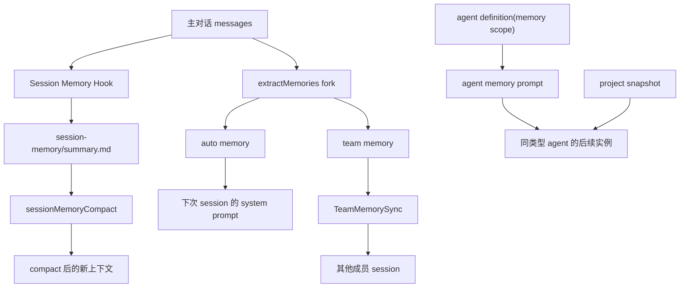

# 跨 Memory Context 机制

## 1. 文档目标

这份文档聚焦 `src/` 里“memory 如何跨不同 context 流动”这一条主线。

这里的 context 不是单指模型上下文窗口，而是几种边界同时存在：

- 主对话与 forked subagent 之间
- 当前会话与后续会话之间
- 个人记忆与 team 共享记忆之间
- 主线程 agent 与具名 agent 类型之间
- 原始长对话与 compact 之后的新上下文之间

从源码看，Claude Code 并没有做一个统一的“大 memory 总线”，而是把 memory 拆成几类职责不同、边界不同的存储，再通过 prompt 注入、fork 继承、文件系统、同步服务把它们串起来。

核心入口主要在：

- `src/services/SessionMemory/sessionMemory.ts`
- `src/services/compact/sessionMemoryCompact.ts`
- `src/services/extractMemories/extractMemories.ts`
- `src/memdir/memdir.ts`
- `src/memdir/paths.ts`
- `src/memdir/teamMemPaths.ts`
- `src/services/teamMemorySync/`
- `src/tools/AgentTool/agentMemory.ts`
- `src/utils/forkedAgent.ts`
- `src/utils/systemPrompt.ts`

## 2. 先区分仓库里的几类 memory

这套实现里至少有四类 memory：

| 类型 | 主要作用 | 典型路径 | 作用范围 |
| --- | --- | --- | --- |
| session memory | 给当前长会话做浓缩摘要，优先服务 compact | `{projectDir}/{sessionId}/session-memory/summary.md` | 只对当前 session 生效 |
| auto memory | 沉淀跨会话可复用信息 | `~/.claude/projects/<project>/memory/` 或 override 路径 | 同一用户、同一项目 |
| team memory | 在项目维度共享长期记忆 | `<autoMemPath>/team/` | 同仓库、同组织成员 |
| agent memory | 给某个 agent 类型持久化经验 | `agent-memory/` 或 `agent-memory-local/` | 同 agent 类型、按 scope 控制 |

它们不是同一个生命周期：

- `session memory` 面向“当前对话压缩续航”
- `auto memory` 面向“下次还记得”
- `team memory` 面向“别人也能继承”
- `agent memory` 面向“这个 agent 类型持续自我积累”

## 3. 跨 Context 的共性设计

虽然几类 memory 分工不同，但源码里有三条共性原则。

### 3.1 用 prompt 注入把 memory 变成当前上下文

memory 真正进入模型可见上下文，主要靠 prompt 注入，而不是额外挂载一个数据库查询层。

- `src/constants/prompts.ts` 在系统 prompt 组装阶段调用 `loadMemoryPrompt()`
- `src/memdir/memdir.ts` 根据是否启用 auto/team memory，构造单目录或双目录 memory prompt
- `src/utils/systemPrompt.ts` 在 agent 有 `memory` 配置时，用 `loadAgentMemoryPrompt()` 把 agent memory 追加进 agent 的 system prompt

因此“跨 context”的第一步其实是：先把持久化文件重新翻译成 prompt 里的行为说明和索引内容。

### 3.2 用 forked agent 共享上下文，但隔离可变状态

memory 更新通常不是主线程直接做，而是 fork 一个子执行链去做。

关键点在 `src/utils/forkedAgent.ts`：

- `createCacheSafeParams()` 把 system prompt、user context、system context、tools、历史消息打包出来
- `runForkedAgent()` 复用这些 cache-safe 参数，尽量命中父会话的 prompt cache
- `createSubagentContext()` 默认克隆 `readFileState`、`contentReplacementState`，并给子链路新的 abort/controller 与 no-op 状态回调

也就是说：

- 可见上下文尽量继承，保证 fork 和主线程看到的是同一份对话语义
- 可变运行态尽量隔离，避免 session memory / extract memories 之类的后台动作污染主线程状态

这就是“跨 context 传语义，不传脏状态”。

### 3.3 用文件路径和权限规则做 memory 边界

memory 最终都落到文件系统，所以边界控制也主要靠路径。

- `src/utils/permissions/filesystem.ts` 为 session memory、auto memory、agent memory 提供专门的读写许可分支
- `src/memdir/teamMemPaths.ts` 对 team memory 的写路径做两段校验：先 `resolve()`，再 `realpath()`，防止 `..` 和 symlink 逃逸
- `src/utils/memoryFileDetection.ts` / `src/utils/sessionFileAccessHooks.ts` 统一识别 memory 文件，补充 telemetry 和 watcher 触发

因此这里不是“逻辑上说它是 memory”，而是“路径进入某个受控目录后，权限、同步、统计都按 memory 规则处理”。

## 4. 链路一：主会话 -> Session Memory -> Compact

这是最典型的“当前上下文跨边界压缩续航”路径。

### 4.1 Session memory 只在主 REPL 线程更新

`src/services/SessionMemory/sessionMemory.ts` 的 `extractSessionMemory()` 明确限制：

- `querySource` 必须是 `repl_main_thread`
- remote mode 不启用
- auto compact 关闭时也不注册这个 hook

初始化入口是 `initSessionMemory()`，它通过 `registerPostSamplingHook()` 在每轮主查询结束后判断要不要更新 session memory。

### 4.2 触发条件是“上下文已足够大”，而不是每轮都写

`shouldExtractMemory()` 组合了几类阈值：

- 会话 token 总量达到初始化门槛
- 距离上次提取又增长了足够 token
- 工具调用数达到阈值，或者至少已经来到一个“末尾没有 tool call”的自然停顿点

对应状态保存在 `src/services/SessionMemory/sessionMemoryUtils.ts`：

- `tokensAtLastExtraction`
- `lastSummarizedMessageId`
- `extractionStartedAt`

这说明 session memory 不是实时镜像，而是“阶段性浓缩快照”。

### 4.3 真正写文件的是一个受限 forked agent

提取流程是：

```text
主线程消息
  -> setupSessionMemoryFile()
  -> buildSessionMemoryUpdatePrompt()
  -> runForkedAgent(querySource='session_memory')
  -> 只允许 Edit summary.md
```

这里有两个关键点：

- `setupSessionMemoryFile()` 会创建 `summary.md`，并在首次创建时写入模板
- `createMemoryFileCanUseTool()` 只允许对子文件执行 `FileEdit`

也就是说，session memory fork 并不是一个通用 agent，它本质上是一个“只准改当前 session 摘要文件”的单用途上下文转换器。

### 4.4 Compact 优先消费 session memory，而不是重新总结整段对话

`src/services/compact/sessionMemoryCompact.ts` 里的 `trySessionMemoryCompaction()` 是这条链路的下游消费者。

它的流程是：

```text
compact 前
  -> waitForSessionMemoryExtraction()
  -> getLastSummarizedMessageId()
  -> getSessionMemoryContent()
  -> calculateMessagesToKeepIndex()
  -> 用 session memory 作为 compact summary
  -> buildPostCompactMessages()
```

这条路径的意义是：

- 已经被 session memory 覆盖的历史，不必再次调用 compact summary 模型
- 只保留摘要之后的一小段 tail，维持 API 合法性和最近交互细节
- 仍然会通过 `processSessionStartHooks('compact')` 恢复 CLAUDE.md 等开场上下文

所以 `session memory` 的本质不是“给用户看的笔记”，而是“预先计算好的 compact 中间态”。

### 4.5 它如何跨过 compact 边界继续生效

`createCompactionResultFromSessionMemory()` 会：

- 构造新的 `compact_boundary`
- 把 `session memory` 变成一条 `isCompactSummary` 的 user message
- 记录 `messagesToKeep`
- 在 boundary 上标注 `preservedSegment`

因此 compact 后的新上下文，不是凭空重建，而是：

```text
旧长对话
  -> session memory 摘要
  + 保留的 tail
  + compact 后恢复的附件/钩子
  = 新对话上下文
```

这就是第一种跨 context：同一 session 内，长历史被提前折叠成 session memory，再跨过 compact 边界续接。

## 5. 链路二：主会话 -> Auto / Team Memory -> 后续会话

这条链路解决的是“这次聊过的东西，下次怎么还在”。

### 5.1 Auto memory 先通过 system prompt 暴露给当前会话

`src/memdir/memdir.ts` 的 `loadMemoryPrompt()` 会把 memory 系统装进 system prompt：

- 只开 auto memory 时，注入 private memory 目录说明
- 同时开 team memory 时，注入 private + team 双目录说明
- assistant/kairos 模式下，改成 daily log 追加式记忆

这一步只注入行为规范和 `MEMORY.md` 索引，不会自动把所有 topic 文件全文塞进 prompt。

### 5.2 会话结束点由后台提取器把新信息沉淀出来

`src/services/extractMemories/extractMemories.ts` 负责在 query loop 完成后做 durable memory 提取。

它的特点：

- 也是 `runForkedAgent()`，共享父对话 cache-safe 上下文
- `createAutoMemCanUseTool()` 只允许 Read/Grep/Glob、只读 Bash，以及对 memory 目录内的 Write/Edit
- 如果主线程已经直接写过 memory 文件，`hasMemoryWritesSince()` 会跳过本轮提取，避免重复劳动

这意味着主线程和后台 extractor 的关系不是竞争，而是互补：

- 主线程自己记了，就不再 fork
- 主线程没记，后台 extractor 补记

### 5.3 Team memory 不是另一套 prompt，而是 auto memory 的共享分支

当 `TEAMMEM` 启用时，`buildCombinedMemoryPrompt()` 会告诉模型：

- private memory 写到 auto memory 根目录
- team memory 写到 `<autoMemPath>/team/`
- 两边各有自己的 `MEMORY.md` 索引

所以 team memory 不是独立系统，而是 auto memory 目录树里的共享子空间。

### 5.4 跨成员传播靠 Team Memory Sync

`src/services/teamMemorySync/` 把 team memory 从本地目录同步到服务端。

核心机制：

- `watcher.ts` 启动时先 `pullTeamMemory()`
- 然后对 team 目录开 `fs.watch`，本地有变更时 debounce 后 `pushTeamMemory()`
- `index.ts` 里 pull 是“服务端覆盖本地”，push 是“只上传 checksum 有变化的 key”

同步 scope 不是靠本地目录名，而是靠 repo slug：

- 通过 `getGithubRepo()` 识别仓库
- 服务端按 repo 维度存 team memory

于是第二种跨 context 出现了：

```text
当前会话
  -> extract memories 写本地 memory 文件
  -> 下次 session 再由 loadMemoryPrompt 注入
  -> 若写入 team 子目录，再由 watcher 推到服务端
  -> 其他成员 session 启动时 pull 下来
```

这条链把“会话上下文”扩展成了“项目长期上下文”和“团队共享上下文”。

## 6. 链路三：Agent 定义 -> Agent Memory -> 同类型 Agent

这条链路解决的是“不同 agent 类型如何拥有自己的长期记忆”。

### 6.1 Agent memory 是 agent definition 的一个 frontmatter 能力

`src/tools/AgentTool/loadAgentsDir.ts` 里，agent 定义支持：

- `memory: user`
- `memory: project`
- `memory: local`

一旦配置了 `memory`：

- `getSystemPrompt()` 会自动把 `loadAgentMemoryPrompt()` 追加进 agent 的 system prompt
- 如果 agent 自己声明了 tools，还会自动补上 `FileRead` / `FileWrite` / `FileEdit`，保证它能操作 memory 文件

所以 agent memory 不是外部服务，而是 agent prompt 的内建能力。

### 6.2 三种 scope 对应三种持久化边界

`src/tools/AgentTool/agentMemory.ts` 中：

- `user`：`~/.claude/agent-memory/<agentType>/`
- `project`：`<cwd>/.claude/agent-memory/<agentType>/`
- `local`：`<cwd>/.claude/agent-memory-local/<agentType>/`，或 remote mount 下的 project namespaced 路径

这说明 agent memory 的“跨 context”不是跨成员，而是跨 agent 实例：

- 只要 agentType 相同，后续实例都能读到这份 memory
- 但 scope 决定它是用户级共享、项目级共享，还是仅本机局部共享

### 6.3 项目还可以给 agent memory 提供 snapshot 种子

`src/tools/AgentTool/agentMemorySnapshot.ts` 额外提供一层“项目预置 agent 记忆”：

- snapshot 放在 `<cwd>/.claude/agent-memory-snapshots/<agentType>/`
- 首次本地 memory 为空时，可 `initializeFromSnapshot()`
- snapshot 更新后，还能检测到“需要提示更新”

这让 agent memory 既能自我积累，也能由项目维护者预灌初始知识。

## 7. 这套“跨 Memory Context”机制到底跨了什么

如果把几条链路合在一起，可以把它概括成下面这张图：



从源码层面，所谓“跨 memory context”主要体现在四件事：

- 同一会话内跨上下文窗口：长对话先折叠成 `session memory`，再穿过 compact 边界续接
- 跨会话：本轮对话经 `extractMemories` 落盘为 auto memory，下次再注入 prompt
- 跨成员：team memory 通过 repo 维度同步，把本地共享子目录扩展成组织内共享上下文
- 跨 agent 类型实例：agent memory 让某个 agentType 的经验可以在后续实例中复用

## 8. 设计上的几个关键判断

### 8.1 它不是“一个 memory 系统”，而是“多层记忆分层”

源码里没有试图用一种存储覆盖所有需求，而是按时间跨度拆层：

- 短期：session memory
- 中长期：auto memory
- 团队长期：team memory
- agent 专属长期：agent memory

这种分层让 compact、协作、agent 自我改进不会互相打架。

### 8.2 它不是直接共享运行态，而是共享可重建的语义

真正跨 context 传播的核心对象不是 React state，也不是 query loop 的内部变量，而是：

- fork 时共享的 cache-safe prompt 语义
- 文件系统里的 memory 内容
- compact 后的 boundary + summary + preserved tail

运行态本身大多通过 `createSubagentContext()` 被隔离掉了。

### 8.3 文件系统是这套机制的真实“记忆总线”

无论是哪种 memory，最后都落在文件上：

- session memory：`summary.md`
- auto/team memory：`MEMORY.md` + topic files
- agent memory：按 agentType 分目录

所以权限、同步、搜索、统计都围绕路径展开。这也是为什么 `filesystem.ts`、`memoryFileDetection.ts`、`teamMemPaths.ts` 在这套机制里和业务逻辑同等关键。

## 9. 一句话总结

Claude Code 的“跨 memory context”机制，本质上是：

**用 forked agent 在不污染主线程状态的前提下，把当前对话提炼成不同层级的文件化记忆，再通过 prompt 注入、compact 边界恢复和 team sync，把这些记忆重新投射回后续的 session、agent 和协作成员上下文中。**

## 10. 相关源码

- `src/services/SessionMemory/sessionMemory.ts`
- `src/services/SessionMemory/sessionMemoryUtils.ts`
- `src/services/SessionMemory/prompts.ts`
- `src/services/compact/sessionMemoryCompact.ts`
- `src/services/extractMemories/extractMemories.ts`
- `src/memdir/memdir.ts`
- `src/memdir/paths.ts`
- `src/memdir/teamMemPaths.ts`
- `src/services/teamMemorySync/index.ts`
- `src/services/teamMemorySync/watcher.ts`
- `src/tools/AgentTool/agentMemory.ts`
- `src/tools/AgentTool/agentMemorySnapshot.ts`
- `src/tools/AgentTool/loadAgentsDir.ts`
- `src/utils/forkedAgent.ts`
- `src/utils/systemPrompt.ts`
